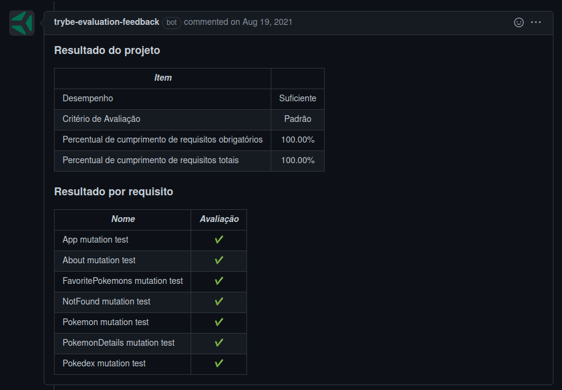

# Welcome to the React Testing Library

## Context

This project was made as a work assignment in during the Trybe web developer course.

The goal was to create the required tests for the application using the React Testing Library. The application is just a small list of Pokemons, with a couple of filters and types. It was developed during the course exercises, but this version was made by the Trybe team.

---

## How to install

For this project, you will need to have installed:
- NPM

Copy the ssh from the project `git@github.com:luciobj/Project-React-Testing-Library.git`

* Open a terminal int your machine and type the following commands in order:

  * `git clone git@github.com:luciobj/Project-React-Testing-Library.git`
  * `cd Project-React-Testing-Library`
  * `npm install`
  * `npm start`

  The app shoud run on the port 3000, and open a window on you default browser, fully operational.

---

### Technologies

In this project the focus was solely on test development, and as such the technologies used were React and RTL.

---

## Evaluator Results

This is a screenshot of the last run of the Trybe evaluator, which scores the demands of the project.

